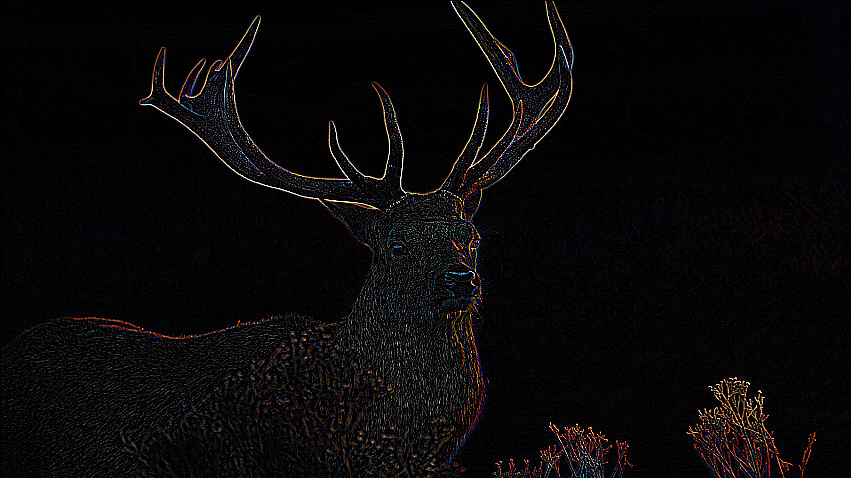

# Kernel Image Processing CUDA
> Parallel Computing project using CUDA.

## Prerequisites
* CUDA 11.6

## Brief introduction
This project is about implementing a program of **kernel image processing**. To do it, we need to perform a **convolution** between a **mask** and an **image**.

Based on which mask we use, we can perform **blurring**, **sharping**, **embossing** and more on the image.

The convolution operation is **embarrassingly parallel**, so it well suited to be implemented in **parallel** with **implicit and explicit threading frameworks**.

We show how we can fully **exploit the hardware** of the GPU to **massively parallelize** the computations needed by the convolution operation.

In fact, we used efficiently the **constant and shared memories** with the **tiling** and the **two-bacth loading** techniques, and 
we used the **asynchronous mechanism** of CUDA, the **streams**, to overlap the data transfer between host and device and the execution of CUDA kernels.

We also show how using a cache friendly data organization in memory, the **Structure of Arrays**, results in coalesced memory accesses that, in turn, give performance improvements.

For more details on the development process of the project and the tools used see the [Final Report](https://github.com/GiovanniBurbi/kernel_image_processing_CUDA/blob/master/Parallel_Computing_Kernel_Image_Processing.pdf).

                                
            

## Experiments setup
To obtain the results shown in the Final Report has been used a machine with:
* Intel© Core™ i7-8750H CPU @ 2.20GHz with 6 cores / 12 threads
* NVIDIA GeForce GTX 1070 Mobile 8GB
                                         
## Getting started
### Using IDE
* **Clone** this repository in your IDE. **Clion** has been used for this project.
* Use the **Visual Studio toolchain** in the respective field in "settings > CMake" of your IDE to enable CUDA
* Set **flags** in the header of "main.cpp" to select the implementation of the algorithm that will be run.
* To **run the CUDA application**
   * In your IDE open the file "main.cu" and run it.
### Using CLI
* Clone this repository.
* Set **flags** in the header of "main.cu" to select the implementation of the algorithm that will run
* Optionally, you can change the **masktype variable** selecting another mask enum value. The default is the outline mask
* **Navigate** inside the src folder of the root directory of the project.
* Then enter in the terminal the following commands to **compile** the files:
  * `nvcc -c --default-stream per-thread main.cu kernel/Kernel.cpp image/Image.cpp image/ImageSoA.cpp image/PpmParser.cpp convolution/convolution.cu`
  * `nvcc main.obj Kernel.obj Image.obj ImageSoA.obj PpmParser.obj convolution.obj -o main`
* Finally, **run the application**:
  `./main`
